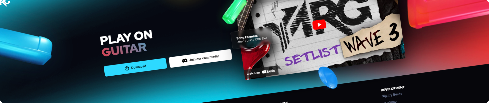

<p align="center">
  <picture>
    
  </picture>
</p>

<p align="center">
    <i>Front-end side of <a href="https://yarg.in">yarg.in</a></i>
</p>

<p align="center">
    
    
</p>

---

This is the main website for the YARG project, handling most static pages like news, features, setlist and contributors section. ~~For the leaderboard and community section, click here.~~ (soon)

## 🔨 Getting Started

### Pre-requisites
- [NodeJS](https://nodejs.org/)

### Starting the development server

1. Install dependencies

    ```shell
    npm i
    ```

2. Run the development server

    ```shell
    npm run dev
    ```

The local development page should be live on http://localhost:3000


## ✍️ Contributing

If you want to contribute with the website, please feel free! 

We recommend joining [our Discord](https://discord.gg/sqpu4R552r) and heading over to **#leaderboard-dev** with your contribution idea before starting any work to make sure there's no conflifts with another contributors work.

We have our website all mocked-up by our design team. If you need to add new sections added or make changes to the design, please check before with the design team on our Discord.
